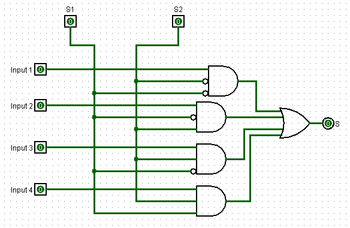

# Multiplexador 4x1

Este circuito implementa um multiplexador (MUX) 4x1, que seleciona uma entre quatro entradas de dados e a encaminha para a saída. A seleção é controlada por dois sinais de controle (S1 e S2), permitindo escolher qual das quatro entradas será transmitida.

   
  <a href="./Circuitos_Logisim/Multiplexer 4x1.circ">Link do Multiplexador</a>

**Aplicações comuns:** seleção de fontes de dados em CPUs, roteamento de sinais em sistemas digitais, implementação de funções lógicas programáveis e multiplexação de barramentos de dados.

---

## 1. Objetivo do Circuito

Dado quatro entradas de dados (Input 1, Input 2, Input 3, Input 4) e dois sinais de seleção (S1 e S2), o circuito encaminha o valor de uma das entradas para a saída S, de acordo com a combinação binária dos sinais de controle.

---

## 2. Estrutura do Circuito

### 2.1 Entradas e Saídas
**Entradas:**
- **Input 1, Input 2, Input 3, Input 4:** as quatro linhas de dados de entrada.
- **S1 e S2:** sinais de seleção que determinam qual entrada será encaminhada para a saída.

**Saídas:**
- **S:** saída do multiplexador, que recebe o valor da entrada selecionada.

### 2.2 Componentes Principais

- 4 portas AND de 3 entradas cada.
- 1 porta OR de 4 entradas.
- 2 inversores (portas NOT) para gerar os complementos de S1 e S2.

### **Funções dos componentes:**
- As portas AND implementam a lógica de seleção, habilitando apenas a entrada correspondente à combinação de S1 e S2.
- Os inversores geram os sinais complementares ¬S1 e ¬S2, necessários para decodificar todas as combinações de seleção.
- A porta OR combina as saídas das portas AND, garantindo que apenas o sinal selecionado chegue à saída.

---

## 3. Funcionamento do Circuito

### 3.1 Operação Básica

**A) Decodificação dos sinais de seleção:**  
Os sinais S1 e S2 formam um código binário de 2 bits (00, 01, 10, 11) que determina qual entrada será transmitida.

**B) Habilitação condicional:**  
Cada porta AND recebe uma das entradas de dados e uma combinação específica de S1, S2, ¬S1 e ¬S2. Apenas a porta AND correspondente à combinação atual dos sinais de seleção produzirá saída 1 (se sua entrada de dados for 1).

**C) Combinação das saídas:**  
A porta OR agrega as saídas das quatro portas AND. Como apenas uma delas está ativa por vez, a saída final reflete exatamente o valor da entrada selecionada.

### 3.2 Lógica de Seleção

As portas AND implementam as seguintes condições:

- **Input 1 selecionado quando:** S1 = 0 e S2 = 0 (¬S1 AND ¬S2 AND Input1)
- **Input 2 selecionado quando:** S1 = 1 e S2 = 0 (S1 AND ¬S2 AND Input2)
- **Input 3 selecionado quando:** S1 = 0 e S2 = 1 (¬S1 AND S2 AND Input3)
- **Input 4 selecionado quando:** S1 = 1 e S2 = 1 (S1 AND S2 AND Input4)

### Tabela de Seleção:

| S2 | S1 | Entrada Selecionada | Saída S |
|:--:|:--:|:-------------------:|:-------:|
| 0  | 0  | Input 1             | Input 1 |
| 0  | 1  | Input 2             | Input 2 |
| 1  | 0  | Input 3             | Input 3 |
| 1  | 1  | Input 4             | Input 4 |

### 3.3 Fluxo dos Dados

1. Os sinais de seleção S1 e S2 são aplicados (e seus complementos gerados pelos inversores).
2. Cada porta AND verifica se sua combinação específica de sinais de seleção está ativa.
3. A porta AND correspondente à combinação atual deixa passar o valor de sua entrada de dados.
4. As outras três portas AND produzem saída 0 (bloqueadas).
5. A porta OR combina as quatro saídas, resultando no valor da entrada selecionada.

---

## 4. Exemplo Prático

**Situação:** Queremos selecionar Input 3, cujo valor é 1.

**Configuração:**
- S2 = 1
- S1 = 0
- Input 3 = 1

**Resultado:**
- A terceira porta AND recebe: ¬S1 (1), S2 (1) e Input 3 (1) → saída = 1
- As outras três portas AND estão bloqueadas (saída = 0)
- A porta OR recebe (0, 0, 1, 0) → **Saída S = 1**

O multiplexador transmite com sucesso o valor de Input 3 para a saída.
