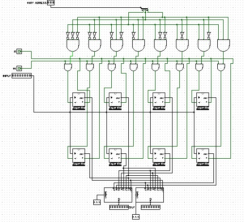

# Banco de Registradores

Este circuito implementa um banco de registradores com 8 registradores de 8 bits cada, totalizando 64 bits de armazenamento. O banco permite operações de escrita (write) em um registrador selecionado por endereço de 3 bits e leitura (read) simultânea de dois registradores através de multiplexadores. É um componente fundamental em arquiteturas de processadores para armazenamento temporário de dados durante a execução de instruções.

<p align="center">
  <br>
  <a href="./Banco de Regs.circ">Link do Banco de Registradores</a>
</p>

**Aplicações comuns:** CPUs (armazenamento de variáveis temporárias), processadores RISC (registradores de propósito geral), microcontroladores, unidades de execução de instruções, pipelines de processamento, sistemas embarcados que necessitam memória rápida e próxima à ALU.

---

## 1. Objetivo do Circuito

O banco de registradores fornece armazenamento rápido e acessível para 8 valores de 8 bits cada. Permite escrever dados em um registrador específico através de um endereço de escrita (WRT ADDRESS) quando o sinal de escrita (W) está ativo, e simultaneamente ler dois registradores diferentes através de dois multiplexadores controlados por endereços de leitura separados. Esta funcionalidade é essencial para operações que precisam de dois operandos (como soma, subtração) onde ambos os valores devem ser acessados simultaneamente.

---

## 2. Estrutura do Circuito

### 2.1 Entradas e Saídas
**Entradas:**
- **INPUT:** dado de 8 bits a ser escrito no registrador selecionado.
- **WRT ADDRESS:** endereço de 3 bits (0-7) que seleciona qual registrador será escrito.
- **W (Write):** sinal de controle que habilita a escrita (1 = escrever, 0 = não escrever).
- **R (Read):** sinal de controle que habilita a leitura dos registradores.
- **Seletor de Leitura 1:** endereço de 3 bits que seleciona qual registrador enviar para OUT 1.
- **Seletor de Leitura 2:** endereço de 3 bits que seleciona qual registrador enviar para OUT 2.

**Saídas:**
- **OUT 1:** saída de 8 bits com o conteúdo do primeiro registrador selecionado.
- **OUT 2:** saída de 8 bits com o conteúdo do segundo registrador selecionado.

### 2.2 Componentes Principais

- 8 registradores de 8 bits, cada um composto por 8 células de memória de 1 bit (Memoria1bit).
- Decodificador de endereço de escrita (usando portas NOT e AND) para ativar apenas o registrador selecionado.
- 2 multiplexadores 8x1 de 8 bits para selecionar quais registradores serão lidos.
- Circuito de controle com portas lógicas para habilitar operações de leitura e escrita.

### **Funções dos componentes:**
- Cada registrador armazena 8 bits de dados usando células de memória SR (Set-Reset) implementadas com portas NAND.
- O decodificador de endereço converte o endereço de 3 bits em 8 linhas de seleção, ativando apenas uma por vez através de portas AND de 3 entradas combinadas com portas NOT para criar todas as combinações possíveis (000 a 111).
- As portas AND combinam o sinal W com cada linha do decodificador, garantindo que apenas o registrador selecionado seja habilitado para escrita.
- Os multiplexadores 8x1 recebem as saídas de todos os 8 registradores e selecionam qual deles será enviado para cada saída, permitindo acesso simultâneo a dois registradores diferentes.
- O sinal R (Read) habilita os multiplexadores através de portas AND, controlando quando os dados podem ser lidos.

---

## 3. Funcionamento do Circuito
### 3.1 Operação Básica

**A) Operação de Escrita:**  
Quando W=1 e um endereço de escrita é fornecido (por exemplo, 011 = registrador 3), o decodificador ativa apenas a linha correspondente ao registrador 3. O dado presente em INPUT é então armazenado nesse registrador através das células de memória de 1 bit. Os outros 7 registradores permanecem inalterados pois suas linhas de enable estão desativadas.

**B) Operação de Leitura:**  
Independentemente da escrita, os multiplexadores sempre têm acesso às saídas de todos os 8 registradores. Quando R=1, os multiplexadores são habilitados e enviam para OUT 1 e OUT 2 os conteúdos dos registradores selecionados pelos endereços de leitura. Por exemplo, se Seletor 1 = 101 (5) e Seletor 2 = 010 (2), OUT 1 recebe o conteúdo do registrador 5 e OUT 2 recebe o conteúdo do registrador 2.

**C) Operação Simultânea:**  
É possível escrever em um registrador enquanto se lê de outros dois simultaneamente. Por exemplo: escrever no registrador 7 enquanto lê os registradores 2 e 4. Esta capacidade é crucial para a eficiência de pipelines de processadores.

**D) Persistência dos Dados:**  
Os dados permanecem armazenados nos registradores enquanto houver alimentação, mesmo quando W=0. As células de memória SR mantêm seu estado até serem explicitamente reescritas.

### 3.2 Propagação dos sinais

**Decodificação de Endereço de Escrita:**

O endereço de 3 bits (A2 A1 A0) é decodificado em 8 linhas através de portas NOT e AND:

| Endereço (A2 A1 A0) | Registrador Selecionado | Equação Lógica |
|---------------------|-------------------------|----------------|
| 000                 | Reg 0                   | Ā2 ∧ Ā1 ∧ Ā0 |
| 001                 | Reg 1                   | Ā2 ∧ Ā1 ∧ A0 |
| 010                 | Reg 2                   | Ā2 ∧ A1 ∧ Ā0 |
| 011                 | Reg 3                   | Ā2 ∧ A1 ∧ A0 |
| 100                 | Reg 4                   | A2 ∧ Ā1 ∧ Ā0 |
| 101                 | Reg 5                   | A2 ∧ Ā1 ∧ A0 |
| 110                 | Reg 6                   | A2 ∧ A1 ∧ Ā0 |
| 111                 | Reg 7                   | A2 ∧ A1 ∧ A0 |

**Exemplo de Operação Completa:**

```
Estado Inicial:
Reg 0: 00000000
Reg 1: 00000001
Reg 2: 00000010
Reg 3: 00000011
Reg 4: 00000100
Reg 5: 00000101
Reg 6: 00000110
Reg 7: 00000111

Operação 1: Escrever 11111111 no Reg 3
- INPUT = 11111111
- WRT ADDRESS = 011
- W = 1
Resultado: Reg 3 agora contém 11111111

Operação 2: Ler Reg 3 e Reg 5 simultaneamente
- Seletor 1 = 011
- Seletor 2 = 101
- R = 1
Resultado: OUT 1 = 11111111, OUT 2 = 00000101

Operação 3: Escrever 10101010 no Reg 0 enquanto lê Reg 3 e Reg 7
- INPUT = 10101010
- WRT ADDRESS = 000
- W = 1
- Seletor 1 = 011
- Seletor 2 = 111
- R = 1
Resultado: Reg 0 = 10101010, OUT 1 = 11111111, OUT 2 = 00000111
```

### Fluxo das Operações:

| Operação | WRT ADDR | W | INPUT | Sel 1 | Sel 2 | R | OUT 1 | OUT 2 | Descrição |
|----------|----------|---|-------|-------|-------|---|-------|-------|-----------|
| Escrita  | 011      | 1 | 10101010 | XXX | XXX | X | ----- | ----- | Escreve no Reg 3 |
| Leitura  | XXX      | 0 | -------- | 011 | 101 | 1 | Reg3  | Reg5  | Lê Reg 3 e 5 |
| Ambas    | 111      | 1 | 11110000 | 000 | 111 | 1 | Reg0  | Reg7  | Escreve em Reg 7, lê 0 e 7 |
| Nenhuma  | XXX      | 0 | -------- | XXX | XXX | 0 | 00000000 | 00000000 | Sem operação |

**Subcircuitos Importantes:**

**Registrador (8 bits):**
- Composto por 8 células Memoria1bit conectadas em paralelo
- Todas compartilham o mesmo sinal de enable
- Entrada de 8 bits é distribuída para as 8 células
- Saída de 8 bits é coletada das 8 células

**Multiplexador 8x1 de 8 bits:**
- Recebe 8 entradas de 8 bits (64 bits total)
- Seletor de 3 bits escolhe qual das 8 entradas enviar para a saída
- Implementado como 8 multiplexadores 8x1 de 1 bit em paralelo
- Construído hierarquicamente: MUX 2x1 → MUX 4x1 → MUX 8x1

**Célula de Memória 1 bit (Latch SR):**
- Usa 4 portas NAND em configuração de flip-flop SR
- Entrada S (set) ativa quando enable=1 e dado=1
- Entrada R (reset) ativa quando enable=1 e dado=0
- Mantém estado quando enable=0
- Saída Q fornece o bit armazenado
