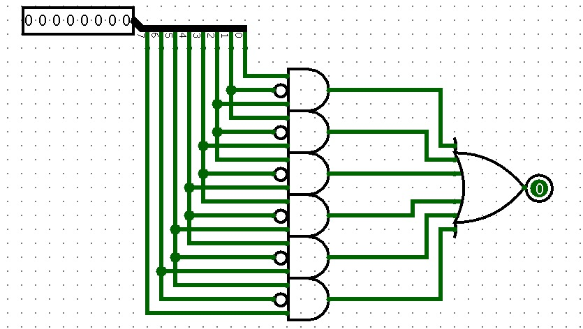

# Detector de Padrão 101

Este circuito implementa um detector de padrão que identifica a sequência binária "101" em qualquer posição de uma entrada de 8 bits. O circuito usa lógica combinacional com portas AND e OR para examinar todas as possíveis posições onde o padrão pode ocorrer, ativando a saída quando o padrão é encontrado.

<p align="center">
  <br>
  <a href="./Detector-101.circ">Link do Detector</a>
</p>

**Aplicações comuns:** Decodificação de sinais digitais, detecção de comandos em protocolos de comunicação, reconhecimento de padrões em sistemas de segurança, análise de sequências binárias, sistemas de controle que respondem a padrões específicos.

---

## 1. Objetivo do Circuito

Dada uma entrada de 8 bits, o circuito verifica se existe a sequência "101" (1-0-1 consecutivos) em qualquer das 6 posições possíveis dentro dos 8 bits. Se o padrão for encontrado em pelo menos uma posição, a saída é ativada (1), caso contrário permanece em 0. O circuito detecta o padrão instantaneamente usando lógica combinacional, sem necessidade de clock ou memória.

---

## 2. Estrutura do Circuito

### 2.1 Entradas e Saídas
**Entradas:**
- **Entrada de 8 bits:** sequência binária a ser analisada.

**Saídas:**
- **Saída (1 bit):** sinal que indica se o padrão "101" foi encontrado (1) ou não (0).

### 2.2 Componentes Principais

- 1 splitter para separar os 8 bits de entrada em sinais individuais.
- 6 portas AND de 3 entradas (uma com entrada negada) para detectar o padrão em cada posição.
- 1 porta OR de 6 entradas para combinar todos os resultados das detecções.

### **Funções dos componentes:**
- O splitter divide o sinal de 8 bits em 8 fios individuais (bit0 a bit7), permitindo acesso independente a cada bit.
- Cada porta AND de 3 entradas verifica uma tripla específica de bits consecutivos: a entrada do meio é negada (NOT) para detectar o "0" no padrão "101".
- A configuração das portas AND é: bit_n ∧ (¬bit_n+1) ∧ bit_n+2, que detecta quando temos 1-0-1 nas posições n, n+1 e n+2.
- A porta OR final combina as saídas das 6 portas AND: se qualquer uma delas detectar o padrão, a saída geral é ativada.

---

## 3. Funcionamento do Circuito

### 3.1 Operação Básica

**A) Divisão da entrada:**  
O splitter separa os 8 bits de entrada em sinais individuais: bit0 (menos significativo) até bit7 (mais significativo).

**B) Detecção paralela em 6 posições:**  
Seis portas AND verificam simultaneamente as posições possíveis para o padrão "101":
- Posição 0-1-2: bit0 ∧ (¬bit1) ∧ bit2
- Posição 1-2-3: bit1 ∧ (¬bit2) ∧ bit3
- Posição 2-3-4: bit2 ∧ (¬bit3) ∧ bit4
- Posição 3-4-5: bit3 ∧ (¬bit4) ∧ bit5
- Posição 4-5-6: bit4 ∧ (¬bit5) ∧ bit6
- Posição 5-6-7: bit5 ∧ (¬bit6) ∧ bit7

**C) Combinação dos resultados:**  
A porta OR recebe as 6 saídas das portas AND. Se pelo menos uma porta AND detectou o padrão (saída = 1), a porta OR ativa a saída final do circuito.

**D) Resultado instantâneo:**  
Como é um circuito puramente combinacional, a resposta é quase instantânea (limitada apenas pelos atrasos de propagação das portas lógicas).

### 3.2 Propagação dos sinais

**Exemplo 1 - Padrão encontrado na posição 0-1-2:**
```
Entrada: 10110011
         ^^^
Bits:    76543210

Posição 0-1-2: bit0=1, bit1=0, bit2=1 → 1∧(¬0)∧1 = 1∧1∧1 = 1 ✓
Saída: 1 (padrão encontrado)
```

**Exemplo 2 - Padrão encontrado em múltiplas posições:**
```
Entrada: 10101010
         ^^^ ^^^
Bits:    76543210

Posição 0-1-2: 0∧(¬1)∧0 = 0
Posição 1-2-3: 1∧(¬0)∧1 = 1 ✓
Posição 2-3-4: 0∧(¬1)∧0 = 0
Posição 3-4-5: 1∧(¬0)∧1 = 1 ✓
Posição 4-5-6: 0∧(¬1)∧0 = 0
Posição 5-6-7: 1∧(¬0)∧1 = 1 ✓

Saída: 1 (padrão encontrado em 3 posições)
```

**Exemplo 3 - Padrão não encontrado:**
```
Entrada: 11111111
Bits:    76543210

Nenhuma posição tem "0" no meio, então nenhuma porta AND ativa.
Saída: 0 (padrão não encontrado)
```

### Fluxo das Operações:

| Entrada (binário) | Entrada (decimal) | Posições com "101" | Saída | Observação |
|-------------------|-------------------|---------------------|-------|------------|
| 10100000          | 160               | 5-6-7               | 1     | Padrão no início (MSB) |
| 00000101          | 5                 | 0-1-2               | 1     | Padrão no fim (LSB) |
| 10101010          | 170               | 1-2-3, 3-4-5, 5-6-7 | 1     | Múltiplas ocorrências |
| 11111111          | 255               | nenhuma             | 0     | Sem "0" no meio |
| 00000000          | 0                 | nenhuma             | 0     | Todos zeros |
| 01010101          | 85                | nenhuma             | 0     | Padrão invertido "010" |
| 11010111          | 215               | 2-3-4               | 1     | Padrão no meio |
| 10110100          | 180               | 4-5-6               | 1     | Uma ocorrência |

**Lógica de detecção:**
Para detectar "101", precisamos verificar se:
1. O primeiro bit é 1 (bit_n = 1)
2. O segundo bit é 0 (bit_n+1 = 0, ou seja, ¬bit_n+1 = 1)
3. O terceiro bit é 1 (bit_n+2 = 1)

A porta AND com entrada negada no meio implementa exatamente essa lógica. Como temos 8 bits de entrada, podemos verificar 6 triplas consecutivas (posições 0-1-2 até 5-6-7), cobrindo todas as possibilidades de ocorrência do padrão.
