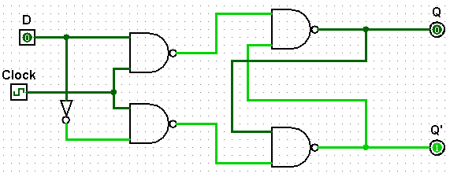
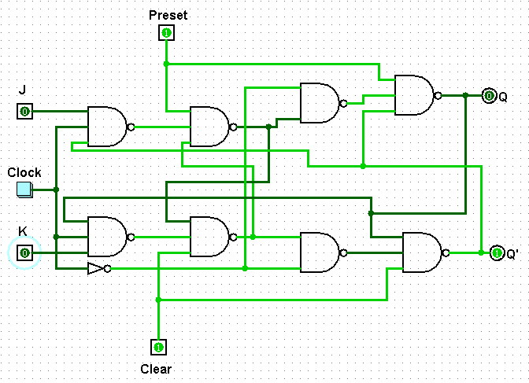

# Flip-Flop D, JK e T (Toggle)

## 1. Flip-Flop D

### Função Geral
O flip-flop D é um circuito sequencial síncrono que armazena um único bit de informação. Ele transfere o valor de sua entrada (D) diretamente para a saída (Q) a cada pulso de clock.

**Aplicações:** registradores, memórias temporárias e armazenamento de dados em pipelines.

---

### 1.1 Objetivo do Circuito
O objetivo do flip-flop D é capturar o valor lógico da entrada D e mantê-lo estável na saída Q até a próxima borda de clock.

---

### 1.2 Estrutura do Circuito
- **Entradas:** D (dado) e Clock.  
- **Saídas:** Q (saída principal) e ¬Q (saída complementar).

   

**Componentes principais:** um latch D controlado diretamente pelo clock.

---

### 1.3 Funcionamento do Circuito
Quando ocorre a borda de subida do clock, o valor presente em D é copiado para Q. O valor permanece até o próximo pulso de clock. Dessa forma, o flip-flop D atua como uma célula de memória simples e direta, sem estrutura mestre–escravo.

---

## 2. Flip-Flop JK

### Função Geral
O flip-flop JK é uma evolução do flip-flop SR, que elimina o estado inválido. Ele permite armazenar, definir, resetar ou alternar o estado da saída dependendo das entradas J e K.

**Aplicações:** contadores síncronos, divisores de frequência e circuitos de controle.

---

### 2.1 Objetivo do Circuito
O objetivo do flip-flop JK é fornecer flexibilidade no controle da saída, podendo alternar entre manter, setar, resetar ou inverter o estado de Q conforme as entradas J e K.

---

### 2.2 Estrutura do Circuito
- **Entradas:** J, K e Clock.  
- **Saídas:** Q e ¬Q.

   

**Componentes principais:** portas NAND, interligadas com um latch controlado por clock.

---

### 2.3 Funcionamento do Circuito
O comportamento é definido assim:
- J=0, K=0 → mantém o estado atual.  
- J=1, K=0 → define Q=1.  
- J=0, K=1 → reseta Q=0.  
- J=1, K=1 → alterna o estado de Q.

As alterações acontecem apenas na borda de clock, garantindo operação síncrona.

---

### 2.4 JK Mestre–Escravo
O flip-flop JK mestre–escravo é uma versão aprimorada do JK padrão, projetada para resolver problemas de instabilidade.

**Diferenças e vantagens principais:**

1. **Estrutura de dois estágios:**  
   O modelo mestre–escravo usa dois latches (um mestre e um escravo) acionados em **fases opostas do clock**.  
   Enquanto o mestre captura as entradas durante a borda ativa, o escravo só atualiza a saída quando o clock muda de fase. Isso evita que o sinal de saída retorne imediatamente às entradas, impedindo realimentações indesejadas.

2. **Eliminação de oscilações (glitches):**  
   No JK padrão, quando J=K=1, a saída pode alternar várias vezes durante o mesmo pulso de clock, gerando instabilidade.  
   O mestre–escravo impede isso ao isolar temporariamente o estágio mestre do escravo, garantindo **transições únicas e controladas**.

3. **Maior confiabilidade e previsibilidade:**  
   Por evitar múltiplas mudanças de estado no mesmo ciclo, o mestre–escravo é **mais estável** e **preferido em circuitos síncronos** e contadores digitais.

**Conclusão:**  
O flip-flop JK mestre–escravo é preferível ao JK padrão por **eliminar realimentações diretas, evitar oscilações e garantir operação confiável**, especialmente em aplicações de contagem e sincronização.

---

## 3. Flip-Flop T (Toggle)

### Função Geral
O flip-flop T (ou *Toggle*) é uma variação derivada do JK, onde as duas entradas J e K são conectadas juntas, formando uma única entrada **T**.

**Aplicações:** contadores binários, divisores de frequência e circuitos de temporização.

---

### 3.1 Objetivo do Circuito
O objetivo do flip-flop T é **alternar o estado da saída (Q)** a cada pulso de clock quando **T = 1**, e **manter o estado** quando **T = 0**.

---

### 3.2 Estrutura do Circuito
- **Entradas:** T e Clock.  
- **Saídas:** Q e ¬Q.

**Componentes principais:** um flip-flop JK com J = K = T.

---

### 3.3 Funcionamento do Circuito
O comportamento é simples:
- T=0 → mantém o estado atual de Q.  
- T=1 → inverte (alterna) o estado de Q a cada pulso de clock.

Em resumo, o flip-flop T é essencialmente um **divisor de frequência por 2**, pois alterna seu estado a cada ciclo de clock.

---

## 4. Comparativo entre Flip-Flops

| Tipo | Entradas | Função Principal | Aplicação |
|:----:|:----------:|:------------------:|:-----------:|
| **D** | D, CLK | Armazenar dados simples | Registradores e memórias |
| **JK** | J, K, CLK | Alternar e controlar estado | Contadores e controle lógico |
| **T** | T, CLK | Alternar estado (toggle) | Divisores de frequência e contadores binários |
