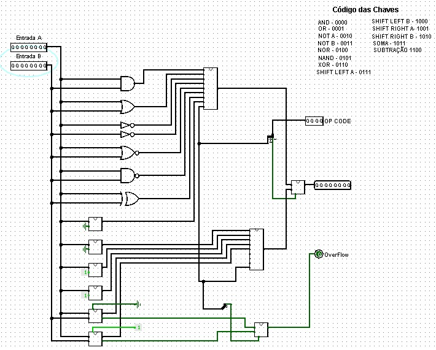

# ULA de 8 bits (Unidade Lógica e Aritmética)

Este circuito implementa uma Unidade Lógica e Aritmética (ULA) completa de 8 bits, capaz de realizar 13 operações diferentes: operações lógicas (AND, OR, NOT, NOR, NAND, XOR), operações aritméticas (soma e subtração), e operações de deslocamento de bits (shift left e shift right). A operação é selecionada por um código de 4 bits (OP CODE).

<p align="center">
  <br>
  <a href="./ULA_8_bits.circ">Link da ULA</a>
</p>

**Aplicações comuns:** Processadores, microcontroladores, calculadoras digitais, sistemas embarcados, coprocessadores aritméticos, e qualquer sistema que necessite realizar operações matemáticas e lógicas.

---

## 1. Objetivo do Circuito

Dadas duas entradas de 8 bits (A e B) e um código de operação de 4 bits (OP CODE), a ULA executa a operação selecionada e produz um resultado de 8 bits, além de sinais de status como overflow (para operações aritméticas).

---

## 2. Estrutura do Circuito

### 2.1 Entradas e Saídas
**Entradas:**
- **Entrada A:** primeiro operando de 8 bits.
- **Entrada B:** segundo operando de 8 bits.
- **OP CODE:** código de 4 bits que seleciona a operação (0000 a 1100).

**Saídas:**
- **Saída:** resultado da operação (8 bits).
- **OverFlow:** sinal de overflow para operações aritméticas (1 bit).

### 2.2 Componentes Principais

- **Multiplexadores 8x1:** selecionam qual operação será enviada para a saída.
- **Portas lógicas:** AND, OR, NOT, NOR, NAND, XOR para operações lógicas.
- **Somador/Subtrator de 8 bits:** realiza adição e subtração.
- **Deslocadores de bits:** realizam shift left e shift right.
- **Splitters:** dividem e combinam os bits conforme necessário.

### **Funções dos componentes:**
- As portas lógicas realizam operações bit a bit entre A e B.
- O somador/subtrator usa somadores completos em cascata com entrada de carry.
- Os deslocadores movem os bits para esquerda ou direita.
- Os multiplexadores selecionam qual resultado enviar para a saída baseado no OP CODE.

---

## 3. Funcionamento do Circuito

### 3.1 Operações Disponíveis

#### **Tabela de Códigos de Operação:**

| OP CODE | Operação         | Descrição                                      |
|---------|------------------|------------------------------------------------|
| 0000    | AND              | A AND B (operação lógica E bit a bit)        |
| 0001    | OR               | A OR B (operação lógica OU bit a bit)        |
| 0010    | NOT A            | Inverte todos os bits de A                    |
| 0011    | NOT B            | Inverte todos os bits de B                    |
| 0100    | NOR              | A NOR B (negação de OR)                       |
| 0101    | NAND             | A NAND B (negação de AND)                     |
| 0110    | XOR              | A XOR B (OU-exclusivo bit a bit)              |
| 0111    | SHIFT LEFT A     | Desloca A para esquerda (multiplica por 2)    |
| 1000    | SHIFT LEFT B     | Desloca B para esquerda (multiplica por 2)    |
| 1001    | SHIFT RIGHT A    | Desloca A para direita (divide por 2)         |
| 1010    | SHIFT RIGHT B    | Desloca B para direita (divide por 2)         |
| 1011    | SOMA             | A + B (adição binária)                        |
| 1100    | SUBTRAÇÃO        | A - B (subtração binária)                     |

### 3.2 Fluxo de Operação

**A) Entrada dos dados:**  
Os valores de A e B são carregados nas entradas de 8 bits.

**B) Processamento paralelo:**  
Todas as operações são calculadas simultaneamente:
- Portas lógicas calculam AND, OR, XOR, etc.
- Somador/subtrator calcula soma e subtração.
- Deslocadores calculam shifts.

**C) Seleção:**  
O OP CODE controla os multiplexadores para selecionar qual resultado será enviado para a saída.

**D) Saída:**  
O resultado de 8 bits é apresentado, junto com o sinal de overflow (quando aplicável).

---

## 4. Detalhamento das Operações

### 4.1 Operações Lógicas

**AND (0000):**
```
Exemplo: A = 10110011, B = 11001100
Resultado: 10000000
```

**OR (0001):**
```
Exemplo: A = 10110011, B = 11001100
Resultado: 11111111
```

**XOR (0110):**
```
Exemplo: A = 10110011, B = 11001100
Resultado: 01111111
```

### 4.2 Operações Aritméticas

**SOMA (1011):**
- Utiliza somadores completos em cascata.
- Propaga o carry entre os bits.
- Gera sinal de overflow se o carry sair do bit mais significativo.

**SUBTRAÇÃO (1100):**
- Implementada como A + (complemento de 2 de B).
- Usa porta XOR para inverter B quando necessário.
- Adiciona 1 através do carry inicial.

### 4.3 Operações de Deslocamento

**SHIFT LEFT (0111/1000):**
- Move todos os bits uma posição para esquerda.
- Insere 0 no bit menos significativo.
- Equivale a multiplicar por 2.

**SHIFT RIGHT (1001/1010):**
- Move todos os bits uma posição para direita.
- Insere 0 no bit mais significativo.
- Equivale a dividir por 2 (divisão inteira).

---

## 5. Subcircuitos Importantes

### 5.1 Somador Completo (Full Adder)

<p align="center">
  Somador de 1 bit com entrada de carry.<br>
  <br>
  <a href="./somador_completo.circ">Link do Somador</a>
</p>

**Entradas:** A, B, Cin  
**Saídas:** S (soma), Cout (carry out)  
**Equações:**
- S = A ⊕ B ⊕ Cin
- Cout = (A ∧ B) ∨ (Cin ∧ (A ⊕ B))

### 5.2 Somador/Subtrator de 8 bits

**Funcionamento:**
- Para soma: conecta 8 somadores completos em cascata.
- Para subtração: inverte B usando XOR e adiciona 1 via carry inicial.
- Sinal M (modo) controla soma (M=0) ou subtração (M=1).

### 5.3 Deslocador de 2 bits

**Funcionamento:**
- Dois estágios de deslocamento de 1 bit.
- Sinal de controle define direção (esquerda ou direita).
- Usa portas AND e OR para rotear os bits.

---

## 6. Características e Vantagens

### Vantagens:
- **Versatilidade:** 13 operações diferentes em um único circuito.
- **Eficiência:** Todas as operações calculadas em paralelo.
- **Modularidade:** Fácil adicionar novas operações.
- **Escalabilidade:** Pode ser expandido para 16, 32 ou 64 bits.
- **Completude:** Cobre operações lógicas, aritméticas e de deslocamento.

### Limitações:
- Não realiza multiplicação ou divisão direta (apenas por potências de 2).
- Sem operações de rotação (apenas shift).
- Não possui registradores internos.

---

## 7. Expansão e Melhorias

### 7.1 ULA de 16 bits
- Duplicar o número de somadores e portas lógicas.
- Usar OP CODE de 4 bits (suficiente para até 16 operações).

### 7.2 Adicionar operações:
- **Rotação:** ROL (Rotate Left), ROR (Rotate Right).
- **Comparação:** Maior que, menor que, igual.
- **Incremento/Decremento:** A+1, A-1.
- **Multiplicação:** Usando algoritmo de shift-and-add.

### 7.3 Flags de status:
- **Zero:** resultado é zero.
- **Negativo:** bit mais significativo é 1.
- **Carry:** houve carry na operação.
- **Overflow:** houve overflow aritmético.

---

## 8. Tabela de Teste

| OP CODE | A (decimal) | B (decimal) | Resultado Esperado | Descrição |
|---------|-------------|-------------|--------------------|-----------|
| 0000    | 15 (00001111) | 3 (00000011) | 3 (00000011) | AND |
| 0001    | 15 (00001111) | 3 (00000011) | 15 (00001111) | OR |
| 0110    | 15 (00001111) | 3 (00000011) | 12 (00001100) | XOR |
| 1011    | 5 (00000101) | 3 (00000011) | 8 (00001000) | SOMA |
| 1100    | 8 (00001000) | 3 (00000011) | 5 (00000101) | SUBTRAÇÃO |
| 0111    | 4 (00000100) | X | 8 (00001000) | SHIFT LEFT A |
| 1001    | 8 (00001000) | X | 4 (00000100) | SHIFT RIGHT A |

---

## 9. Integração com Processadores

A ULA é o coração de qualquer processador, responsável por executar as instruções aritméticas e lógicas. Em um processador completo:

1. **Unidade de Controle** decodifica a instrução e gera o OP CODE.
2. **Registradores** fornecem os operandos A e B.
3. **ULA** executa a operação.
4. **Flags** são atualizados conforme o resultado.
5. **Resultado** é armazenado de volta em um registrador.

---

## 10. Simulação e Teste no Logisim

### Procedimentos:
1. **Carregar o circuito:** Abrir ULA_8_bits.circ.
2. **Definir entradas:** Usar pinos de entrada para A, B e OP CODE.
3. **Testar cada operação:** Variar OP CODE de 0000 a 1100.
4. **Verificar resultados:** Comparar saídas com valores esperados.
5. **Testar overflow:** Realizar somas que excedem 255 (11111111).

### Casos de teste importantes:
- **Soma com overflow:** 200 + 100 = 300 (overflow)
- **Subtração negativa:** 5 - 10 = -5 (resultado negativo)
- **Shift com perda de bits:** 128 << 1 = 0 (bit mais significativo perdido)
- **Operações lógicas com padrões:** 0xFF AND 0x0F, etc.

---

## Conclusão

A ULA de 8 bits é um componente fundamental em sistemas digitais, demonstrando como operações complexas podem ser construídas a partir de portas lógicas e somadores básicos. Este circuito serve como base para entender o funcionamento interno de processadores e como instruções de máquina são executadas no hardware.
