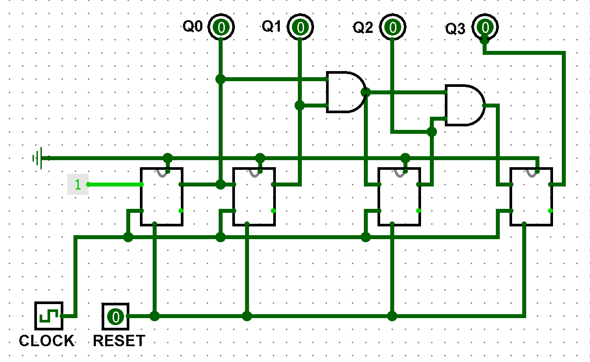

# Contador Síncrono 

Este circuito implementa um contador binário síncrono de 4 bits: a cada pulso de clock, ele incrementa o valor em 1, e após alcançar 1111 ele volta para 0000. Todas as mudanças de estado ocorrem simultaneamente, evitando atrasos acumulados provocados pelo efeito de “ripple”, típico de contadores assíncronos.

   
  <a href=".Circuito Logisim/13-Contador-Sincrono.circ">Link do Contador</a>

**Aplicações comuns:** CPUs (temporização, divisores de frequência, geração de endereços), sistemas de controle, interfaces digitais para contagem de eventos e registros de tempo.

---

## 1. Objetivo do Circuito

Dado um pulso de clock e, opcionalmente, um sinal de controle Reset, o circuito produz uma sequência binária crescente, atualizando todos os bits simultaneamente.  A contagem reinicia automaticamente após alcançar o limite definido (4 bits) ou quando o sinal Reset é acionado.

---

## 2. Estrutura do Circuito

### 2.1 Entradas e Saídas
**Entradas:**
- **Clock:** sinal de pulso que sincroniza as transições de estado dos flip-flops.
- **Reset:** força o contador ao estado inicial `0000`.

**Saídas:**
- **Q0, Q1, Q2, Q3:** os 4 bits do valor atual do contador.

### 2.2 Componentes Principais

- 4 flip-flops tipo T.
- Portas AND em cascata (para gerar as entradas T condicionais).
- 4 pinos com display para visualizar a saída.

### **Funções dos componentes:**
- Os flip-flops armazenam cada bit da contagem. Um flip-flop T alterna seu estado sempre que sua entrada T está ativa no pulso de clock.
- As portas AND decidem quando cada flip-flop superior deve alternar, com base no estado dos bits inferiores.
- Pinos com display permitem ver a saída em tempo real.

---

## 3. Funcionamento do Circuito

  Representação de um Flip-Flop tipo T no Logisim. 
   
  <a href="./1-xxxxx.circ">Link do Flip-Flop T</a>

### 3.1 Operação Básica

**A) Antes do pulso:**  
Todas as saídas Q dos flip-flops já estão definidas e as portas AND calculam os sinais T.

**B) Na subida do clock:**  
Cada flip-flop compara sua entrada T. Se T = 1, ele inverte; se T = 0, mantém seu estado.

**C) Após o pulso:**  
Novas saídas Q são apresentadas, e as portas AND recalculam para o próximo pulso.

**D) Ciclo contínuo:**  
Esse ciclo se repete indefinidamente, voltando para o estado inicial quando atingir o limite de 4 bits ou quando o Reset é acionado.

### 3.2 Propagação dos sinais

- **Q0:** sempre alterna a cada pulso de clock (`T0 = 1`), pois sua entrada T está conectada a um nível lógico constante 1.
- **Q1:** alterna apenas quando `Q0 = 1` (`T1 = Q0`).
- **Q2:** alterna quando `Q0 = 1` e `Q1 = 1` (`T2 = Q0 AND Q1`).
- **Q3:** alterna quando `Q0 = 1`, `Q1 = 1` e `Q2 = 1` (`T3 = Q0 AND Q1 AND Q2`).

Essas condições são detectadas pelas **portas AND em cascata**, que geram os sinais de controle T responsáveis por determinar quais flip-flops devem alternar seu estado a cada pulso de clock.

### Fluxo das Operações:

| Pulso | Q3 Q2 Q1 Q0 | Mudanças nos Flip-Flops T                                |
|-------|-------------|----------------------------------------------------------|
| 0     | 0000        | Estado inicial                                           |
| 1     | 0001        | Q0 alterna                                               |
| 2     | 0010        | Q1 alterna (Q0=1 no momento anterior)                  |
| 3     | 0011        | Q0 alterna novamente                                     |
| 4     | 0100        | Q2 alterna (Q0=1 e Q1=1 no momento anterior)           |
| 5     | 0101        | Q0 alterna                                               |
| 6     | 0110        | Q1 alterna (Q0=1)                                       |
| 7     | 0111        | Q0 alterna                                               |
| 8     | 1000        | Q3 alterna (Q0=1, Q1=1, Q2=1)                           |
| 9     | 1001        | Q0 alterna                                               |
| 10    | 1010        | Q1 alterna (Q0=1)                                       |
| 11    | 1011        | Q0 alterna                                               |
| 12    | 1100        | Q2 alterna (Q0=1 e Q1=1)                                |
| 13    | 1101        | Q0 alterna                                               |
| 14    | 1110        | Q1 alterna (Q0=1)                                       |
| 15    | 1111        | Q0 alterna                                               |
| 16    | 0000        | Volta para o início                                    |
