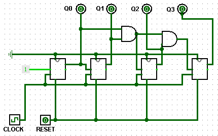

# Contador Síncrono 

Este circuito implementa um contador binário síncrono de 4 bits: a cada pulso de clock, ele incrementa o valor em 1, e após alcançar 1111 ele volta para 0000. Todas as mudanças de estado ocorrem simultaneamente, evitando atrasos acumulados provocados pelo efeito de “ripple”, típico de contadores assíncronos.

   /
  <a href="./13-ContadorSicrono.circ">Link do Contador</a>

**Aplicações comuns:** CPUs (temporização, divisores de frequência, geração de endereços), sistemas de controle, interfaces digitais para contagem de eventos e registros de tempo.

---

## 1. Objetivo do Circuito

Dado um pulso de clock e, opcionalmente, um sinal de controle reset, o circuito produz uma sequência binária crescente, atualizando todos os bits simultaneamente.  A contagem reinicia automaticamente após alcançar o limite definido (4 bits) ou quando o sinal Reset é acionado.
